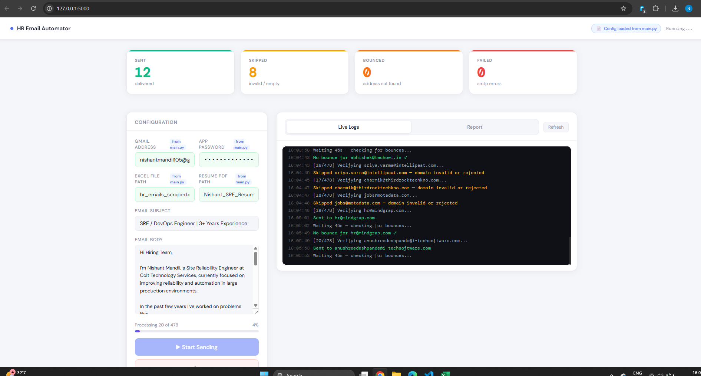

# 📬 HR Email Automator

> Automated cold outreach tool for job seekers — verifies addresses before sending, detects bounces in real time, logs everything to a persistent Excel report, and ships with a clean web dashboard UI.


---

## 🖥️ Dashboard Preview

```
┌─────────────────────────────────────────────────────────────────────┐
│  ● HR Email Automator          📄 Config loaded from main.py   Idle │
├──────────────┬──────────────┬──────────────┬────────────────────────┤
│   ✅ SENT    │  ⚠ SKIPPED  │  🔴 BOUNCED  │      ❌ FAILED         │
│      24      │      6       │      2       │          1             │
│  delivered   │ invalid/empty│ addr not fnd │     smtp errors        │
├──────────────┴──────────────┴──────────────┴────────────────────────┤
│  CONFIG                    │  LIVE LOGS                             │
│  ─────────────────────     │  ────────────────────────────────────  │
│  Gmail     ██████████████  │  10:22:01  Config loaded from main.py  │
│  Password  ██████████████  │  10:22:03  [1/87] Verifying hr@co.com  │
│  Excel     ██████████████  │  10:22:04  MX record found ✅          │
│  Resume    ██████████████  │  10:22:05  Sent to hr@company.com ✅   │
│  Subject   ██████████████  │  10:22:06  Waiting 45s for bounces...  │
│  Body      ██████████████  │  10:23:01  No bounce detected ✓        │
│                            │                                        │
│  ████ ▶ Start Sending ████ │  [ Live Logs ]  [ Report ]             │
│  ░░░░ ◼ Stop          ░░░░ │                                        │
└────────────────────────────┴────────────────────────────────────────┘
```

---

## 🚀 The Problem This Solves

Sending cold emails from a spreadsheet blindly causes:

| Problem | How This Tool Fixes It |
|---|---|
| Emails sent to dead/fake domains | ❌ DNS MX record check kills them before sending |
| `"Address not found"` bounces flooding inbox | ✅ IMAP bounce detection during 45s sleep window |
| No record of what was sent | ✅ Persistent Excel report — appends across every run |
| Script crash = lost progress | ✅ Every row saved to disk immediately, not at end |
| Spam-flagged for sending too fast | ✅ 45-second rate limit between sends |
| Editing code just to change email content | ✅ Subject + body editable live in the web UI |
| Having to re-enter Gmail/paths every run | ✅ Auto-loads config from `main.py` on dashboard open |

---

## ✨ Features

**Verification (3 layers before any email is sent)**
- Format check via regex — catches malformed addresses instantly
- Fake/generic address blocklist — filters `noreply@`, `admin@`, `test@`, etc.
- DNS MX record check — confirms the domain can actually receive email, no port 25 needed

**Sending**
- Resume PDF attached automatically to every outgoing email
- 45-second rate limit between sends to stay under Gmail's spam radar
- Auto-reconnects to Gmail SMTP if the connection drops mid-run

**Bounce Detection**
- Connects to Gmail IMAP during the 45s sleep window
- Scans for unread `mailer-daemon@googlemail.com` failures mentioning the address just sent
- Updates the report row from `Sent` → `Bounced` automatically

**Reporting**
- Every result saved to `email_report.xlsx` immediately — not at the end
- Appends to existing report across multiple runs — full outreach history in one file
- Timestamped rows: know exactly when each email was sent
- Statuses: `Sent`, `Skipped`, `Bounced`, `Failed`

**Web Dashboard**
- Live stat counters: Sent / Skipped / Bounced / Failed, updated every 1.5s
- Progress bar showing `Processing 12 of 87` with percentage
- Dark terminal-style live log console — color-coded per event level
- Report viewer tab — loads `email_report.xlsx` as a live table with status badges
- Config auto-loaded from `main.py` on page open — pre-filled fields highlighted in green
- Stop button — safely halts between emails without corrupting the report

---

## 📁 Project Structure

```
hr-email-automator/
│
├── app.py                    # Flask web server + all automation logic
├── main.py                   # Standalone CLI version (config source for UI)
├── email_template.py         # Email subject + body for CLI mode
├── templates/
│   └── index.html            # Web dashboard UI
│
├── hr_emails_scraped.xlsx    # Input: HR emails list
├── Nishant_SRE_Resume.pdf    # Resume attached to every email
└── email_report.xlsx         # Auto-generated output (appends across runs)
```

---

## ⚙️ Setup

### 1. Clone the repo

```bash
git clone https://github.com/nishantmandil/hr-email-automator.git
cd hr-email-automator
```

### 2. Install dependencies

```bash
pip install flask dnspython pandas openpyxl
```

### 3. Prepare your Excel file

Must have exactly these two columns:

| Company Name | HR Email |
|---|---|
| Google | hr@google.com |
| Razorpay | talent@razorpay.com |
| | careers@infosys.com |

Blank company names are handled gracefully — email still sends without breaking.

### 4. Configure Gmail credentials

In `main.py`:

```python
EMAIL = "your_email@gmail.com"
PASSWORD = "your_app_password"
resume_path = "Your_Name_Resume.pdf"
excel_file = "hr_emails_scraped.xlsx"
```

> ⚠️ Use a [Gmail App Password](https://support.google.com/accounts/answer/185833), **not** your real Gmail password. Requires 2FA enabled on your account.

### 5. Enable IMAP in Gmail (required for bounce detection)

> Gmail → Settings → See all settings → Forwarding and POP/IMAP → **Enable IMAP** → Save

---

## ▶️ Run — Web Dashboard (Recommended)

```bash
python app.py
```

Open **http://localhost:5000** — config is auto-loaded from `main.py`.

## ▶️ Run — CLI (No UI)

```bash
python main.py
```

---

## 🔍 How Verification Works

```
Email Address
      │
      ▼
┌──────────────────────────┐
│  1. Format Check         │  Regex — catches abc@, @gmail.com, etc.
└─────────────┬────────────┘
              │ pass
              ▼
┌──────────────────────────┐
│  2. Fake Address Check   │  Blocks noreply@, test@, admin@, info@...
└─────────────┬────────────┘
              │ pass
              ▼
┌──────────────────────────┐
│  3. DNS MX Record Check  │  Confirms domain can receive email
│     (port 53, never      │  Hard fail on NXDOMAIN / NoAnswer
│      blocked by ISP)     │  Soft fail on timeout (don't skip)
└─────────────┬────────────┘
              │ pass
              ▼
         ✅ Send Email
              │
              ▼
┌──────────────────────────┐
│  4. Bounce Check (IMAP)  │  During 45s sleep — scans inbox for
│     post-send            │  mailer-daemon failure notices
└──────────────────────────┘
```

> **Why DNS-only and not SMTP port 25?** Port 25 is blocked by most ISPs in India and corporate networks. All SMTP handshake checks timed out and fell back to "assume valid" — causing every bad address to still get sent to. DNS MX lookups use port 53 which is never blocked, and reliably confirm whether a domain is configured to receive email at all.

---

## 📊 Output Report

`email_report.xlsx` is created on first run and appended on every subsequent run:

| Company Name | HR Email | Status | Error | Sent At |
|---|---|---|---|---|
| Google | hr@google.com | Sent | | 2025-03-14 10:22:01 |
| Razorpay | bad@nodomain.xyz | Skipped | Domain has no MX record | 2025-03-14 10:22:03 |
| EY | manish12.agarwal@in.ey.com | Bounced | Address not found — bounce from mailer-daemon | 2025-03-14 10:23:01 |
| Infosys | noreply@infosys.com | Skipped | Generic/placeholder email address | 2025-03-14 10:23:02 |

> Script stopped or crashed mid-run? Every row processed before the stop is already on disk. Resume from where you left off.

---

## 🧰 Tech Stack

| Library | Purpose |
|---|---|
| `flask` | Web dashboard server |
| `smtplib` | Gmail SMTP login and sending |
| `imaplib` | Gmail IMAP for bounce detection |
| `dns.resolver` | MX record lookups (dnspython) |
| `re` | Email format validation |
| `ast` | Safe parsing of `main.py` config |
| `pandas` | Excel read/write |
| `openpyxl` | Excel engine for pandas |
| `threading` | Non-blocking send job in web mode |
| `email.message` | MIME email construction with PDF attachment |

---

## 👤 Author

**Nishant Mandil**
Site Reliability Engineer @ Colt Technology Services

[](https://www.linkedin.com/in/nishant-mandil-07b165159/)
[](https://github.com/nishantmandil)
[](https://portfolio.taurbykaur.co.in/)

---

## 📄 License

This project is licensed under the [MIT License](LICENSE).

---

## 🛡️ Responsible Usage

- Built for **personal job outreach only**
- Gmail sending limit: ~500 emails/day for regular accounts
- 45-second delay between sends prevents spam flagging
- Do not use for bulk unsolicited marketing or spam
